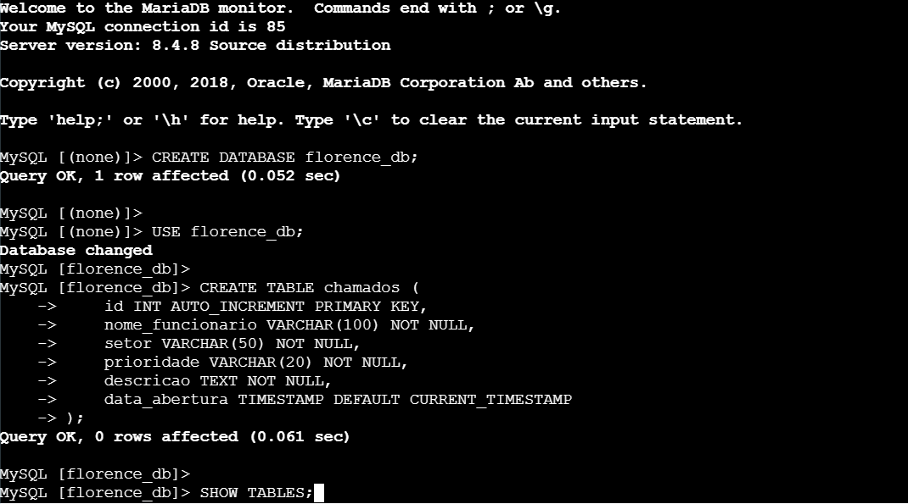

# 🏥 Projeto 03 — Data Pipeline & Cloud Infrastructure: Helpdesk Clínica Florence


---

## 📌 Sobre o Projeto

Este projeto prático simula a construção ponta a ponta de uma infraestrutura em nuvem na AWS projetada para capturar, processar e armazenar dados de chamados de suporte técnico (TIC) de uma clínica médica. 

O objetivo principal foi estabelecer uma **fundação de dados sólida e segura** para habilitar futuras análises de negócios (Cloud Data Analytics), permitindo a extração de métricas críticas como SLAs de atendimento, produtividade da equipe e identificação de gargalos operacionais.

---

## 🏗️ Arquitetura da Solução

A infraestrutura foi totalmente provisionada utilizando a prática de **Infrastructure as Code (IaC)** com AWS CloudFormation, garantindo replicação rápida, padronização e controle de versão.

```text
       [ Usuário / Funcionário ]
                  │
                  ▼
    [ Portal Web (Frontend) ] ───────► Hospedado no Amazon S3
                  │ (POST Request JSON)
                  ▼
 ┌─────────────────────────────────────────────────────────┐
 │                        Amazon VPC                       │
 │                                                         │
 │  ┌───────────────────────────────────────────────────┐  │
 │  │ Sub-rede Pública                                  │  │
 │  │                                                   │  │
 │  │   [ API REST Backend ] ◄──── Amazon EC2 (Flask)   │  │
 │  └──────────────┬────────────────────────────────────┘  │
 │                 │ (Tratamento e INSERT via PyMySQL)     │
 │  ┌──────────────▼────────────────────────────────────┐  │
 │  │ Sub-redes Privadas (Security by Design)           │  │
 │  │                                                   │  │
 │  │   [ Banco de Dados ] ◄────── Amazon RDS (MySQL)   │  │
 │  └───────────────────────────────────────────────────┘  │
 └─────────────────────────────────────────────────────────┘
```

---

## 🛠️ Tecnologias e Serviços Utilizados

| Camada | Tecnologia / Serviço | Função no Pipeline |
|---|---|---|
| **Frontend** | **AWS S3 / HTML / JS** | Hospedagem Serverless do portal web para registro de chamados. |
| **Backend / API** | **AWS EC2 / Python (Flask)** | Servidor escutando requisições (POST) e processando a regra de negócio. |
| **Banco de Dados** | **AWS RDS (MySQL)** | Armazenamento relacional isolado em sub-redes privadas por segurança. |
| **Infraestrutura** | **AWS CloudFormation** | Automação e provisionamento de todos os recursos de rede e servidores. |

---

## 🚀 Próximos Passos (Data Analytics)

Com a esteira de dados (Pipeline) validada e os chamados sendo ingeridos corretamente no banco MySQL relacional, a próxima fase do projeto consiste em plugar ferramentas de visualização (como **Power BI**, **Metabase** ou **Amazon QuickSight**) diretamente ao RDS. O foco será construir dashboards analíticos interativos e em tempo real para a gestão da clínica.

---

## 📸 Evidências de Execução e Validação

Para demonstrar o funcionamento real do fluxo de dados (do clique do usuário até a tabela no banco), as etapas foram documentadas abaixo:

### 1. Infraestrutura e Banco de Dados
Provisionamento via CloudFormation, estabelecendo a conexão segura entre o servidor EC2 e o banco de dados relacional isolado.
<p align="center">
  
  
</p>

### 2. Backend e Integração (API Python)
A API desenvolvida em Flask hospedada na EC2, configurada ativamente para "escutar" as requisições do portal web.
<p align="center">
  
</p>

### 3. Teste de Ponta a Ponta (Fluxo do Dado)
Validação do pipeline através do envio de um chamado real pelo portal, com confirmação de recebimento no terminal da API e a respectiva persistência (`INSERT`) no banco de dados.
<p align="center">
  
  
</p>

---

## 🔗 Contato

- **Autor:** João Gabriel
- **LinkedIn:** [Conecte-se comigo](https://www.linkedin.com/in/joaognscmnt-dados/)

---
*Projeto desenvolvido visando a estruturação de pipelines de dados em nuvem.*
