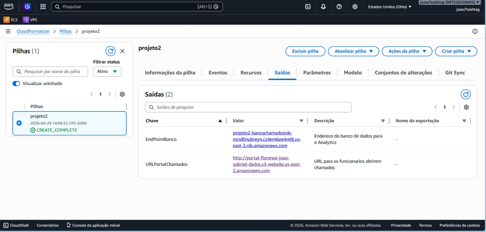
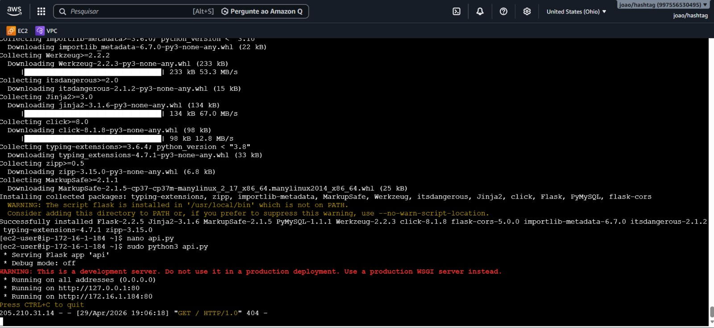
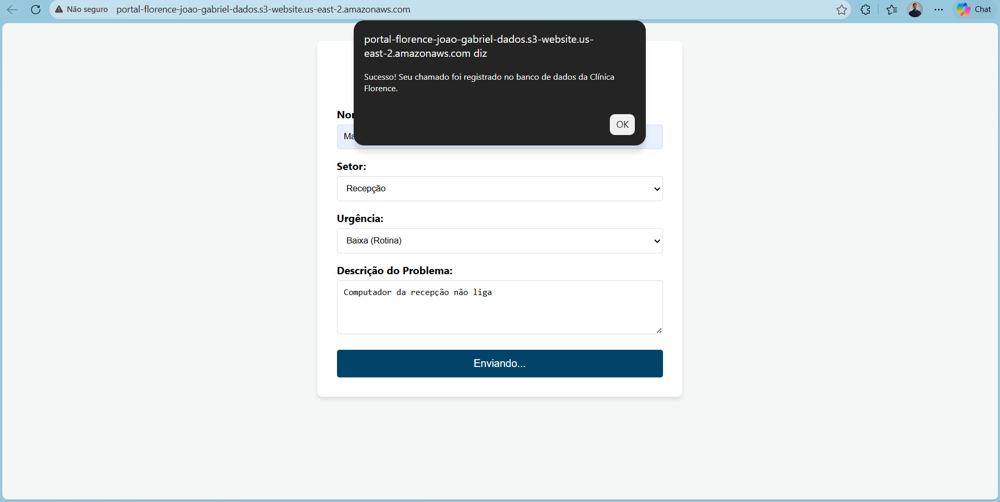
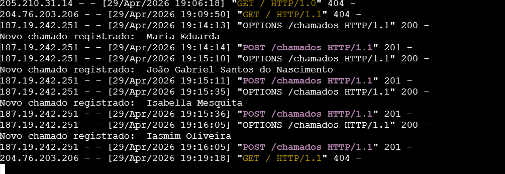

# 🏥 Data Pipeline & Cloud Infrastructure - Helpdesk Clínica Florence

## 📌 Sobre o Projeto
Este projeto simula a construção de uma infraestrutura em nuvem na AWS para capturar, processar e armazenar dados de chamados de suporte técnico (TIC) de uma clínica médica. O objetivo é estabelecer a fundação de dados para futuras análises de SLAs, produtividade e gargalos de atendimento usando ferramentas de Data Analytics.

## 🏗️ Arquitetura da Solução
A infraestrutura foi provisionada utilizando **Infrastructure as Code (IaC)** com AWS CloudFormation, garantindo replicação rápida e controle de versão.

* **Frontend (AWS S3):** Hospedagem estática do portal web (HTML/JS) onde os funcionários registram os chamados.
* **Backend (AWS EC2):** Servidor Linux rodando uma API em Python (Flask) para interceptar os dados via método POST.
* **Database (AWS RDS):** Banco de dados relacional (MySQL) isolado em sub-redes privadas para garantir a segurança das informações corporativas.

## 🛠️ Tecnologias Utilizadas
* **Cloud:** AWS (S3, EC2, RDS, VPC, CloudFormation)
* **Dados:** MySQL (Modelagem e DDL)
* **Programação:** Python (Flask, PyMySQL), HTML, JavaScript
* **Práticas:** IaC, Serverless Frontend, API REST

## 🚀 Próximos Passos (Data Analytics)
Com os dados sendo ingeridos corretamente no banco MySQL relacional, a próxima fase do projeto consiste em plugar uma ferramenta de visualização (como PowerBI, Metabase ou Amazon QuickSight) diretamente no RDS para construir dashboards analíticos em tempo real.

## 📸 Evidências de Execução e Validação

Para demonstrar o funcionamento do pipeline, as etapas foram documentadas abaixo:

### 1. Infraestrutura e Banco de Dados
A infraestrutura foi provisionada via CloudFormation, estabelecendo a conexão segura entre o servidor e o banco de dados relacional.

  
  

### 2. Backend e Integração (API Python)
A API desenvolvida em Flask foi hospedada na EC2, configurada para "escutar" as requisições do portal e realizar o `INSERT` no MySQL.

  

### 3. Teste de Ponta a Ponta (Fluxo do Dado)
Validação do envio de um chamado real através do portal, com a confirmação de recebimento no terminal e persistência no banco.

  
  

Desenvolvido por João Gabriel - Conecte-se comigo no https://www.linkedin.com/in/joaognscmnt-dados/.
